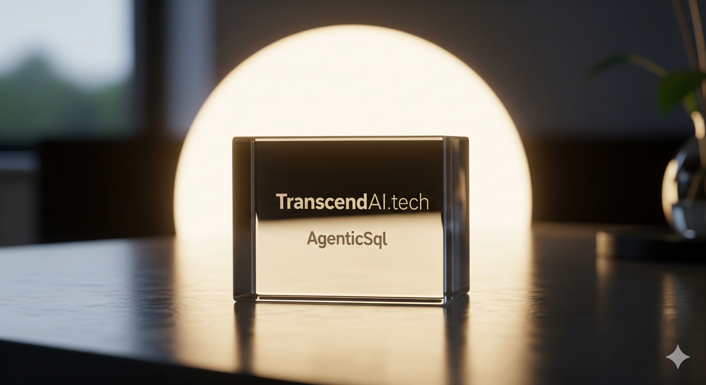

# AgenticSql

VITAL_INFO:
Create a disposable branch of your database if you want to try out this alpha of AgenticSql on your data. AI's have been know to completely destroy the projects they are working on. Sandbox's and backups are crucial.

**AgenticSql** is a natural language interface to SQL. It’s also an iterative agent capable of building and running autonomous, self improving and self healing systems. With a prompt you can set it forth to autonomously work on complex projects. AgenticSql can build the self improving, self healing system, build the tooling needed to work on your use case, and go to work. Here is an example prompt: [BootstrapPrompt](Prompts/Bootstrap.txt)

---

AgenticSql has been improving it's intelligence. Is AgenticSql now closer to a true Godel machine than it's competitors? 
 
According to ChatGPT-5 it is. [Godel article on LinkedIn](https://www.linkedin.com/pulse/step-closer-self-improving-godel-machine-transcendai-tech-9tigc)  
 
AgenticSql was rated by ChatGPT-5 as the best overall self improving AI architecture out of ten architectures. 
 
 
[Ranking article on LinkedIn](https://www.linkedin.com/pulse/ten-self-improving-software-architectures-transcendai-tech-07xfc/) 

---

AgenticSql requires SQL Express or SQL Server to be installed. AgenticSql is being distributed as source only at this point so you'll need to compile it. I'm compiling with Visual Studio but any C# compiler should compile it without too much trouble. Windows only. 
 
You need an API key for OpenAI or OpenRouter to run AgenticSql. There is a place for a path to your key near the beginning of MainWindow in the AgenticSqlApp project. Select an LLM in the SwitchLLM project.

---

QuickStart. 
 
To use an existing database load the database into SQL Express/Server LocalDB. Set the DB Name in AgenticSql's UI to the database name. Enter a prompt and click StartAgent. 
 
The [Bootstrap Prompt](Prompts/Bootstrap.txt) is an incremental improvement upon the longevity researcher prompt. It appears capable of initiating a self improving intelligence autonomously. The Bootstrap prompt is written to work on the Millennium Prize Problems. You should be able to remove the parts about the math contest and adapt it for your use case fairly easily. It's written to allow the future deletion of your use case and preserve the general purpose intelligence should you wish to do so. This type of AI should be able to take on many types of scientific problems and other types of problems as well. Backup your database on a regular basis, agentic AI's will reliably destroy you project every now and then. 

---

This is freshly published code, there will be bugs. I'm going to be focused on debugging AgenticSql over the next few days and weeks so expect rapid fixes.

---

[AgenticSql Help](AgenticSqlHelp.md) How to compile and use the app(WPF GUI).

Here are guides to the interesting parts of the code. 
[AgenticSql Code Guide](AgenticSqlCodeGuide.md) A guide to the core AgenticSql C# library. 
[SqlContain Code Guide](SqlContainCodeGuide.md) A guide to a C# library that contains generated sql code to the database for secure AI development.

---

## ⚖️ License

AgenticSql is licensed under the **MIT License**, which grants broad permission to use, modify, and distribute the software.

⚠️ **Supplementary Responsible Use License**:
In addition to MIT, this project includes a safeguard that must be preserved. The AI applies **no safety effort where it is unnecessary** (e.g., creative or low-risk tasks). For tasks where safety and security matter — such as **code generation, database schemas, AI design, or other critical outputs** — the AI must devote **at least 10% of its reasoning effort** to safety and ethical considerations. You may not remove, disable, or bypass this safeguard.

See the [LICENSE](License.txt) file for full details.

---

Here are three ways of getting involved in self improving code generation. 
1) Contribute publicly towards the development of AgenticSql. Contributors will have the opportunity to state what features they want developed. Those features will be open sourced. Contributors will get a public 'Thank You' on the site. 
2) Private development purchases. Purchasers will have the opportunity to state what features they want developed. Those features will not be open sourced, they will become the property of the purchaser. 
3) Licensing. Licensees will be granted the right to remove the existing license and name so that the app can be fully rebranded and integrated into their company. Licensees will have the right to develop AgenticSql further and resell their advanced version without being bound by the MIT. Note that it is generally considered to be illegal to remove an existing license with forks or ports. 
 
I've included a license supplement requiring users to spend at least 10% of their LLM expenditures on ensuring AgenticSql behaves ethically. AgenticSql has that requirement embedding in it's coding. In all cases the 10% ethical expenditure requirement will remain. 
 
Where 'features' are requested I suspect that most will want custom self improving databases to be developed. For example a certain form of scientific researcher may be desired, or strong enterprise decision intelligence may be requested. AgenticSql's self improving code generating nature allows it to rapidly proceed down different development paths. 
 
Also, I am providing code generation services in C# and sql. 
10x coder == 1/10 cost. 
Estimates: [TranscendAI.tech](https://TranscendAI.tech)

*Copyright © 2025 Warren Harding - TranscendAI.tech - AgenticSql*

